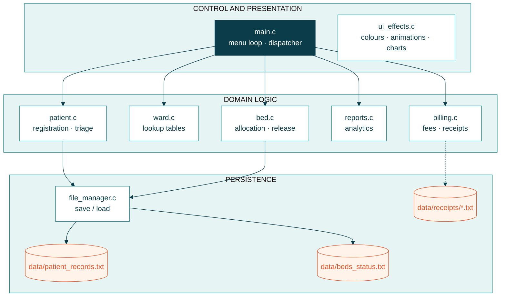
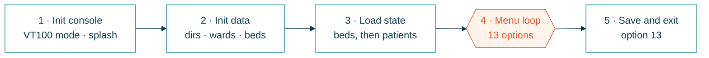
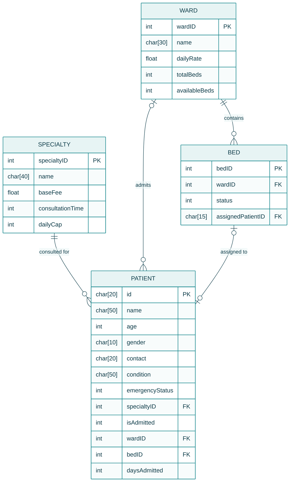
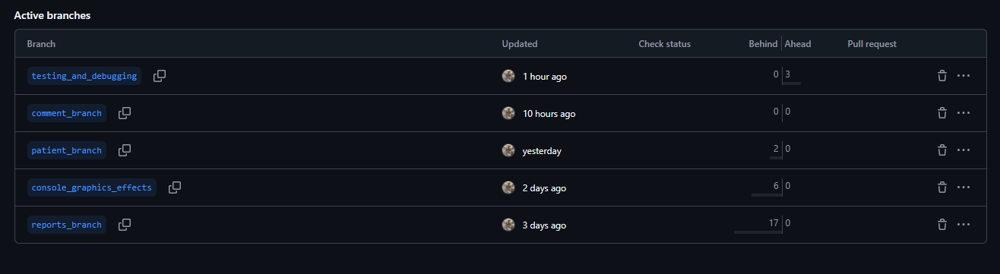

<div align="center">


# Smart Hospital & Resource Allocation System

**A menu-driven C console application for patient triage, ward and bed allocation, billing and hospital analytics.**


[](https://github.com/kwh440/Smart-Hospital-Resource-Allocation-System)

</div>

| | |
|---|---|
| **Course** | CSC 1012 Introduction to Computer Programming |
| **University** | University of Sri Jayewardenepura |
| **Student** | K.T.D.K.Himesh Wijethunga |
| **Student ID** | AS20250647 |
| **Submitted** | 2026/Sep/20 |
| **Repository** | [github.com/kwh440/Smart-Hospital-Resource-Allocation-System](https://github.com/kwh440/Smart-Hospital-Resource-Allocation-System) |

---

## Table of Contents

1. [Introduction](#1-introduction)
2. [Features](#2-features)
3. [Getting Started](#3-getting-started)
4. [Usage](#4-usage)
5. [Project Structure](#5-project-structure)
6. [System Architecture](#6-system-architecture)
7. [Core Business Rules](#7-core-business-rules)
8. [Data Structure Design](#8-data-structure-design)
9. [Data Persistence](#9-data-persistence)
10. [Version Control](#10-version-control)
11. [Author and Contribution](#11-author-and-contribution)

---

## 1. Introduction

A hospital has to decide, quickly and repeatedly, **who needs care first, where each patient should stay, and what the stay will cost.** The *Smart Hospital & Resource Allocation System* is a console application written in C that supports those decisions. It registers patients, ranks them by urgency, recommends and allocates ward beds, produces itemised bills and summarises hospital performance.

The project applies structured, modular C programming (structs, arrays, functions and file I/O) to a realistic problem. It runs in any terminal and stores its data in plain text files, so **no database or external library is required.**

| 8 | 58 | 4 / 45 | ~2.8k |
|:---:|:---:|:---:|:---:|
| source modules | functions | wards / beds | lines of C |

---

## 2. Features

| Area | What the system does |
|---|---|
| **Patient management and triage** | Registers patients with duplicate detection · shows the directory in arrival order · builds a priority queue (Critical → Urgent → Normal) · searches by ID or partial name · updates patient records |
| **Ward and bed management** | Lists 7 doctor specialties and 4 wards · shows a live bed matrix, bed cards and ward tables · recommends a ward from age and urgency · allocates the first free bed · discharges patients and releases beds |
| **Financials and analytics** | Calculates consultation fee, emergency surcharge, ward cost and age subsidy · exports an itemised receipt per patient · reports triage mix, revenue, bed occupancy and the highest bill |
| **Data persistence** | Saves and reloads patients and bed status between runs using semicolon-delimited text files |
| **Console experience** | ANSI colours, loading spinners, progress bars and block bar charts, with validated input throughout |

---

## 3. Getting Started

### 3.1 Prerequisites

| Requirement | Details |
|---|---|
| Language and standard | C, C99 / C11 compliant (ANSI C standard) |
| Compiler | GCC 4.8+, MinGW-w64, Clang 3.8+ or MSVC 2017+ |
| IDE / tools | Code::Blocks v20.03 or later (recommended with GCC / MinGW), or a command-line terminal (PowerShell, Bash, CMD) |
| Operating system | Windows 10 / 11, Linux or macOS |
| Target binary | Pure CLI console application |
| Terminal | ANSI VT100 Virtual Terminal colour support (UTF-8 for box-drawing characters) |
| Storage | Read / write access to the local `./data/` directory (`patient_records.txt`, `beds_status.txt`); billing receipts are written to `data/receipts/` |

**Standard C library dependencies** (built in, no external libraries needed)

| Header | Used for | Functions used |
|---|---|---|
| `stdio.h` | Console and file I/O | `printf`, `scanf`, `fgets`, file I/O |
| `stdlib.h` | Process control and conversion | `system`, `atoi` |
| `string.h` | String manipulation | `strcmp`, `strcpy`, `strlen`, `strtok`, `strcspn` |
| `ctype.h` | Character classification | `tolower` |

### 3.2 Clone the repository

```bash
git clone https://github.com/kwh440/Smart-Hospital-Resource-Allocation-System.git
cd Smart-Hospital-Resource-Allocation-System
```

### 3.3 Build and run

**Command line (GCC / MinGW)**

**For Windows (PowerShell / Command Prompt):**

```powershell
# 1. Build (Compile all C files from src/ into bin/hospital_app.exe)
gcc -Wall -std=c99 -I src src/*.c -o bin/hospital_app.exe
# 2. Run
.\bin\hospital_app.exe
```

**For Linux / macOS (Terminal):**

```bash
# 1. Build
gcc -Wall -std=c99 -I src src/*.c -o hospital
# 2. Run
./hospital
```

**Code::Blocks**

1. Create a new *Console application (C)* project and add all `.c` and `.h` files.
2. Build and run (`F9`).

> Run the program from the repository's root folder so the `data/` directory is created next to it. It is created automatically on first run.

---

## 4. Usage

The main menu offers 13 options in three groups.

| # | Option | Handler function |
|:---:|---|---|
| 1 | Register new patient | `registerPatient` |
| 2 | Display patients directory | `displayPatients` |
| 3 | Display priority triage queue | `displayPriorityTriageQueue` |
| 4 | Search patient record | `searchPatient` |
| 5 | Update patient record | `updatePatientRecord` |
| 6 | Display doctor specialties | `displaySpecialties` |
| 7 | Display hospital wards | `displayWards` |
| 8 | Display ward bed status tables | `displayBedOccupancyMetrics` |
| 9 | Allocate bed (with ward recommendation) | `allocateBed` |
| 10 | Discharge patient and release bed | `releaseBed` |
| 11 | Generate performance reports and analytics | `generatePerformanceReport` |
| 12 | Calculate admission bill and export receipt | `processBillCalculation` |
| 13 | Save data and exit | `savePatientRecords` + `saveBedStatus` |

**Typical workflow**

1. Register a patient (option 1) and choose a triage level.
2. Allocate a bed (option 9) or let registration auto-allocate one.
3. Generate the bill (option 12) **before** discharging the patient.
4. Discharge the patient (option 10) when the stay ends.
5. Review the analytics (option 11).
6. Choose **option 13** to save; data is written to disk only on exit.

**Example bill** (Level 3 Critical patient, Cardiology, 4 days in ICU)

```text
 Base Consultation Fee:   LKR    4500.00
 Emergency Surcharge:     LKR    2250.00 (50%)
 Ward Stay Cost (4 Days): LKR  100000.00
------------------------------------------------------------------------
 Gross Total Bill:        LKR  106750.00
 Age Subsidy Discount:    LKR -     0.00 (0%)
------------------------------------------------------------------------
 Final Payable Amount:    LKR  106750.00
 Estimated Waiting Time:  0.00 mins (Immediate Attention)
```

---

## 5. Project Structure

```text
Smart-Hospital-Resource-Allocation-System/
├── src/
│   ├── main.c                 # entry point, menu loop, dispatcher
│   ├── patient.c / .h         # registration, validation helpers, triage, search, update
│   ├── ward.c / .h            # ward and specialty lookup tables
│   ├── bed.c / .h             # bed matrix, ward recommendation, allocate / release
│   ├── billing.c / .h         # fee formulas, wait time, receipt export
│   ├── reports.c / .h         # analytics report
│   ├── file_manager.c / .h    # save / load of patients and beds
│   └── ui_effects.c / .h      # colours, animations, charts
├── data/                      # created at run time
│   ├── patient_records.txt
│   ├── beds_status.txt
│   └── receipts/
│       └── <patientID>_receipt.txt
├── docs/
│   ├── screenshots/           # program screenshots
│   ├── github-branches.png
│   ├── usjp-logo.png
│   └── Smart_Hospital_Project_Report.pdf
├── .gitignore
├── requirements.txt
└── README.md
---

## 6. System Architecture

The code is split by responsibility into three layers. `main.c` only orchestrates; the domain modules own the business rules and never touch files directly; `file_manager.c` is the single gateway to disk; `ui_effects.c` isolates every terminal-styling concern.



Arrows show which layer calls which; the dashed arrow is `billing.c` writing the per-patient receipt files.

**Program lifecycle**



| Module | Responsibility | Lines |
|---|---|:---:|
| `main.c` | Entry point, 13-option menu, dispatcher, save on exit | 151 |
| `patient.c/.h` | Input validation, registration, triage queue, search, update | 507 |
| `ward.c/.h` | Ward and specialty lookup tables, ward lookup | 120 |
| `bed.c/.h` | 45-bed matrix, ward recommendation, allocate / release, occupancy views | 531 |
| `billing.c/.h` | Fee formulas, surcharge, subsidy, wait time, receipt export | 309 |
| `reports.c/.h` | Triage, revenue, occupancy and top-bill analytics | 203 |
| `file_manager.c/.h` | Save / load patient and bed files, data folder setup | 237 |
| `ui_effects.c/.h` | ANSI colours, spinners, progress bars, charts, alerts | 331 |

---

## 7. Core Business Rules

| Rule | Logic implemented |
|---|---|
| **Triage ordering** | Level 3 (Critical) → 2 (Urgent) → 1 (Normal). A stable bubble sort runs on a *temporary copy*, so arrival order is kept for ties and the directory is untouched. |
| **Ward recommendation** | Critical → ICU (4) · age under 12 → Paediatric (2) · Urgent → Surgical (3) · otherwise General (1). It is advisory: the user may pick another ward. The menu labels it "AI Recommendation", but it is rule-based. |
| **Bed allocation** | First-fit: the lowest free bed ID in the chosen ward. The bed record and ward counters are updated together. |
| **Billing** | `Gross = base fee + surcharge + (ward daily rate × days)`. Surcharge is 0 % / 20 % / 50 % of the base fee for Level 1 / 2 / 3. A 15 % subsidy applies to the gross total if the patient is under 5 or over 65. `Final = Gross − Subsidy`. |
| **Wait-time estimate** | Critical = 0 min. Otherwise (non-critical patients of the same specialty) × average consultation minutes; falls back to all non-critical patients if that queue is empty. |

**Wards**

| ID | Ward | Beds | Bed IDs | Rate (LKR / day) |
|:---:|---|:---:|---|---:|
| 1 | General Ward | 20 | 101 – 120 | 3,000 |
| 2 | Paediatric Ward | 10 | 201 – 210 | 6,000 |
| 3 | Surgical Ward | 10 | 301 – 310 | 12,000 |
| 4 | ICU | 5 | 401 – 405 | 25,000 |

There are 7 specialties with base fees from LKR 1,500 (General Practice) to LKR 5,000 (Neurology), average consultation times of 15–30 minutes and daily caps of 10–30 patients.

---

## 8. Data Structure Design

Four `typedef struct` records model the domain. They live in **statically allocated global arrays** (no `malloc`), which keeps memory use predictable and avoids leaks. Records refer to each other by **ID value instead of pointers**, so every relationship can be written to and restored from text files.

| Variable | Type | Capacity | Notes |
|---|---|---|---|
| `patients[]` | `Patient` | 100 (`MAX_PATIENTS`) | Filled sequentially; `patientCount` is the live length (≈ 17.6 KB) |
| `beds[]` | `Bed` | 45 (`TOTAL_BEDS_IN_HOSPITAL`) | One entry per physical bed, fixed at start-up (≈ 1.2 KB) |
| `wards[]` | `Ward` | 4 (`MAX_WARDS`) | Lookup table; `availableBeds` is a live counter |
| `specialties[]` | `Specialty` | 7 (`MAX_SPECIALTIES`) | Read-only lookup for fees and consultation times |



<details>
<summary><b>Field reference: Patient (patient.h)</b></summary>

| Field | Type | Description |
|---|---|---|
| `id` | `char[20]` | Unique key generated as `PAT-%04d`, starting at `PAT-1001` |
| `name` | `char[50]` | Full name |
| `age` | `int` | Years, validated 1–120; drives ward recommendation and subsidy |
| `gender` | `char[10]` | "Male" or "Female" |
| `contact` | `char[20]` | Telephone number (with name, forms the duplicate key) |
| `condition` | `char[50]` | Medical condition / visit reason |
| `emergencyStatus` | `int` | Triage level: 1 = Normal OPD, 2 = Urgent, 3 = Critical |
| `specialtyID` | `int` | Foreign key to `specialties[]`, 1–7 |
| `isAdmitted` | `int` | 1 = ward admission, 0 = outpatient |
| `wardID` | `int` | Foreign key to `wards[]`, 1–4; 0 for OPD |
| `bedID` | `int` | Foreign key to `beds[]` (e.g. 401); 0 when no bed |
| `daysAdmitted` | `int` | Length of stay in days (0–365); feeds the ward cost |

</details>

<details>
<summary><b>Field reference: Bed, Ward and Specialty</b></summary>

| Struct | Field | Type | Description |
|---|---|---|---|
| `Bed` | `bedID` | `int` | Unique ID by ward block: 101–120, 201–210, 301–310, 401–405 |
| | `wardID` | `int` | Owning ward, 1–4 |
| | `status` | `int` | 0 = Available, 1 = Occupied |
| | `assignedPatientID` | `char[15]` | Patient ID, or the string "None" when free |
| `Ward` | `wardID` | `int` | Primary key, 1–4 |
| | `name` | `char[30]` | General, Paediatric, Surgical, ICU |
| | `dailyRate` | `float` | Accommodation cost in LKR per day |
| | `totalBeds` / `availableBeds` | `int` | Fixed capacity and live free-bed counter |
| `Specialty` | `specialtyID` | `int` | Primary key, 1–7 |
| | `name` | `char[40]` | e.g. Cardiology, Neurology, ENT |
| | `baseFee` | `float` | Consultation fee in LKR |
| | `consultationTime` / `dailyCap` | `int` | Average minutes and daily patient limit |

</details>

---

## 9. Data Persistence

Data is loaded at start-up and saved when the user chooses **option 13**.

```text
data/patient_records.txt
<count>
id;name;age;gender;contact;condition;emergencyStatus;specialtyID;isAdmitted;wardID;bedID;daysAdmitted

data/beds_status.txt        (45 lines)
bedID;wardID;status;assignedPatientID

data/receipts/<patientID>_receipt.txt
Human-readable itemised bill, one file per patient, overwritten on each calculation
```

Semicolons separate the fields so names and conditions containing spaces load correctly with `strtok`.

---

## 10. Version Control

This project is version-controlled with Git and hosted on GitHub: [kwh440/Smart-Hospital-Resource-Allocation-System](https://github.com/kwh440/Smart-Hospital-Resource-Allocation-System).

**Branching.** Development followed a simple feature-branch workflow. The stable, working version lives on the `main` branch, while each module or task was developed on its own branch and merged into `main` once it compiled and ran correctly.

| Branch | Purpose |
|---|---|
| `main` | Stable, working version of the project (default branch) |
| `patient_branch` | Patient module: registration, triage queue, search and update |
| `reports_branch` | Performance and analytics report |
| `console_graphics_effects` | Console colours, animations and charts |
| `comment_branch` | Function and file comments |
| `testing_and_debugging` | Testing and bug fixing |

<p align="center">
  <b>Active branches in the GitHub repository</b><br><br>
  
</p>

**Good practices followed**

- **Repository hygiene:** a `.gitignore` excludes compiled binaries (`*.exe`, `*.o`), Code::Blocks `*.depend` / `*.layout` files, `bin/`, `obj/` and temporary or log files, so only source and data are tracked. The `.depend` and `.layout` files had been pushed by mistake earlier in development and were removed from the repository in the final stage of the project.
- **Feature branches:** new work was done on separate branches and merged into `main` only when it was working, which kept `main` stable.
- **Small, frequent commits** with clear messages that describe what changed.
- **Code comments:** comments were added with the help of Gemini 3.6 Flash in Antigravity, on a dedicated `comment_branch`.

---

## 11. Author and Contribution

This is an **individual project**: all design, implementation, testing and documentation were carried out by:

| | |
|---|---|
| **Name** | K.T.D.K.Himesh Wijethunga |
| **Student ID** | AS20250647 |
| **GitHub** | [@kwh440](https://github.com/kwh440) |
| **Role** | Sole developer: all eight modules, the project report and this repository |

---

<div align="center">

**CSC 1012 Introduction to Computer Programming** · University of Sri Jayewardenepura

</div>
